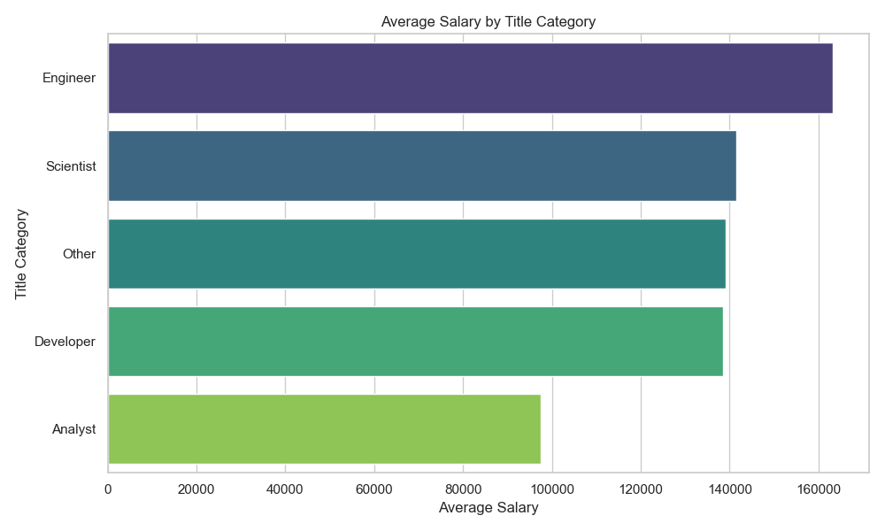

# MSDS697-final-project
Final project in the class (MSDS697 -  Distributed Data Systems)

### Python environment
```bash
pip install airflow[google] pymongo pyspark matplotlib seaborn joblib
```

### Airflow setup
```bash
# Set up the environmental variable
# You would put those exports under .bash_profile or .zshrc
export AIRFLOW_HOME={path/to/github/repo}/airflow
export AIRFLOW_CONFIG={path/to/github/repo}/config/airflow.cfg

export AIRFLOW_CONN_GOOGLE_CLOUD_DEFAULT='{
    "conn_type": "google_cloud_platform",
    "extra": {"key_path": "{path/to/project}/credentials.json",
    "scope": "https://www.googleapis.com/auth/cloud-platform",
    "project": "airflow",
    "num_retries": 5}}'

# run in a terminal
### initialize airflow db
airflow db migrate
# or
# airflow db init

### create user
### id: admin, password: admin
airflow users create --role Admin --username admin --email admin --firstname admin --lastname admin --password admin

### start webserver
### endpoint defined in config/airflow.cfg
### default: http://localhost:8080
airflow webserver

# run in another terminal
### run scheduler
airflow scheduler
```

You also need to set-up the constants defined in dags/example.py if some of them are different except `AIRFLOW_HOME`
```python
# GCS related constants
BUCKET_NAME = "msds697-jobs"
FILE_NAME = "jobs/jobs.json"

# airflow environment variable (do not change)
AIRFLOW_HOME = Path(os.environ.get('AIRFLOW_HOME'))

# local file path
PATH_TO_SAVED_FILE = AIRFLOW_HOME / "airflow" / "jobs.json"

# Mongo DB configuration
DATABASE_NAME = "msds697"
COLLECTION_NAME = "jobs"
MONGODB_HOST = 'localhost'
MONGODB_PORT = 27017
```

### Pipeline tasks


### Artifacts

#### [data analysis] plots
- average_salary.png
 

- ds_job_postings_in_ffang.png


- proportion_of_relevant_postings.png
 

- images/top_companies_by_salary.png


- types_of_job_postings.png


#### [model] test score of salary prediction models
- In `rf_model_evaluation.txt` and `slr_model_evaluation.txt`
```
Root Mean Squared Error (RMSE) on test data = 2210.18
```
